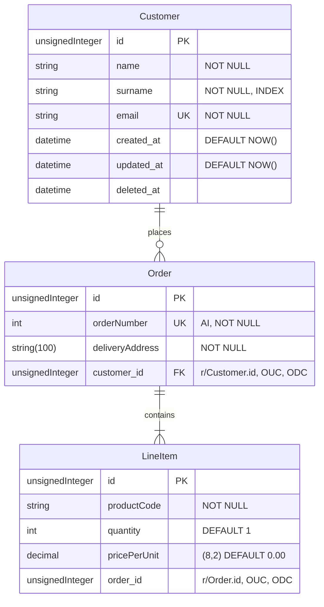

[Back to index](../README.md)

# Laravel Blueprint

<!-- TOC -->
* [Laravel Blueprint](#laravel-blueprint)
  * [Intro](#intro)
  * [Requirements](#requirements)
  * [Installation](#installation)
  * [Generating components](#generating-components)
    * [Defining models](#defining-models)
    * [Defining controllers](#defining-controllers)
<!-- TOC -->

## Intro

Blueprint is an open source project by [Shift](https://laravelshift.com/).\
At its core, it allows developers to rapidly develop multiple Laravel components
from a single, human-readable domain language.

Blueprint uses a simple YAML syntax to define models and controllers, offering shorthands and leveraging conventions to maximize the developer experience.

It comes with artisan commands making it easy and familiar to build new components and reference existing within your Laravel application.

It can be used to generates models, controllers, factories, migrations, form requests, events, jobs, mailables and tests.

The two main purposes of Blueprint are:

1. Increase development speed
2. Promote Laravel conventions

## Requirements

- A Laravel application running version 6.0 or higher.
- It currently assumes a standard project structure using the default App namespace.

## Installation

Install both Blueprint and the Laravel Test Assertion packages as development dependencies of your Laravel application:
```
composer require --dev laravel-shift/blueprint
composer require --dev jasonmccreary/laravel-test-assertions
```

Ignore files Blueprint uses from version control.\
These files are mainly used as a "scratch pad" or "local cache".\
So it's unlikely you'd want to track their changes.

You can quickly add these files to your `.gitignore` with the following command:
```
echo '/draft.yaml' >> .gitignore
echo '/.blueprint' >> .gitignore
```

## Generating components
Blueprint provides `artisan` commands to generate multiple Laravel components from a draft file.\
The draft file contains a definition using a YAML syntax, with a few shorthands for convenience.

By default, the `blueprint:build` command attempts to load a `draft.yaml` (or `draft.yml`) file.\
While you are welcome to create multiple draft files, it's common to simply reuse the draft.yaml file over and over to generate code for your application.

Within the draft file you define models and controllers using an expressive, human-readable YAML syntax.

Let's define a draft file for the following system:



Let's create our `draft.yaml` file by running `php artisan blueprint:new`.\
Make sure that the Lando container is running and that you modify the .env file to enable the connection the DB through the localhost.

With this you get 2 files: `.blueprint` and `draft.yaml`, each of them almost empty.

`.blueprint` holds the cache of the Blueprint plugin, with the reference of all the entities traced.\
At this point, the only entity traced is User (shipped with Laravel).

```yaml
models:
    User: { name: string, email: string, email_verified_at: 'datetime nullable', password: string, remember_token: 'string:100 nullable' }
```

`draft.yaml` will define 2 empty sections: models and controllers.\
Let's play with it!

### Defining models
The docs for model definitions can be found here https://blueprint.laravelshift.com/docs/defining-models/. \
Let's change our model section to be like this:
```yaml
models:
  Customer:
    name: string
    surname: string
    email: email
  Order:
    orderNumber: integer autoIncrement
    deliveryAddress: string:100
  LineItem:
    productCode: string
    quantity: integer default:1
    pricePerUnit: decimal:8,2 default:0.00
```

That covers a good part of the requirements.\
We defined the name of the fields, their type, their default value, their max length and the autoIncrement feature.\
These will all be used for the request validation.

But something is still missing.\
What about our id, created_at, updated_at and deleted_at fields?\
And what about the index and unique constraints or the foreign keys?

Blueprint will automatically add `id`, `created_at` and `updated_at` to any model.\
It also provide a nice shorthand for the `deleted_at` field. We can add it to the model using `softDeletes`.\
For additional constraints, we can use `unique` and `index`.

Let's add this info!

```yaml
models:
  Customer:
    name: string
    surname: string index
    email: email unique
    softDeletes
  Order:
    orderNumber: integer autoIncrement
    deliveryAddress: string:100
  LineItem:
    productCode: string
    quantity: integer default:1
    pricePerUnit: decimal:8,2 default:0.00
```

Ok! Now, what about the foreign keys?\
We have 2 ways to do that.

1. We specify the fields, using the naming convention from Laravel
2. We define the relationships between the models and let Blueprint handle the creation of the fields.

Let's take the second approach.\
To keep the file well organized, it's better to add the relationships at the end of the model, after all the fields.

```yaml
models:
  Customer:
    name: string
    surname: string index
    email: email unique
    softDeletes
    relationships:
      hasMany: Order
  Order:
    orderNumber: integer autoIncrement
    deliveryAddress: string:100
    relationships:
      hasMany: LineItem
      belongsTo: Customer
  LineItem:
    productCode: string
    quantity: integer default:1
    pricePerUnit: decimal:8,2 default:0.00
    relationships:
      belongsTo: Order
```

Blueprint will automatically generate the following foreign keys:

- `customer_id` in the orders table
- `order_id` in the line_items table

So far, so good. Let's move to the controllers.

### Defining controllers

Blueprint can be used to define controllers and their methods.\
In fact, it provides out of the box a very good support for many of the most common methods.

You can list controller methods by name: `index`, `create`, `store`, `show`, `edit`, `update`, and `destroy`.\
The `resource` shorthand automatically infers the model reference based on the controller name and generates the 7 web resource actions.\
It can also be set explicitly as `resource: web`.\
A value of `resource: api` would generate the 5 resource actions of an API controller with the appropriate statements and responses for each action: `index`, `store`, `show`, `update`, and `destroy`.

It is also possible to generate single action controllers, using the `invokable` shorthand.

For each controller method, you may define multiple actions which contain a list of statements.\
Each statement is a `key: value` pair. The list of supported keys is the following.

| **Key**  | **Description**                                                                                                                                                                                                                                                                                                                                   | **Example**                                                   |
|----------|---------------------------------------------------------------------------------------------------------------------------------------------------------------------------------------------------------------------------------------------------------------------------------------------------------------------------------------------------|---------------------------------------------------------------|
| delete   | Generates an Eloquent statement for deleting a model. Blueprint uses the controller action to infer which statement to generate.                                                                                                                                                                                                                  | `delete: post`                                                |
| dispatch | Generates a statement to dispatch a Job using the `value` to instantiate an object and pass any data. If the referenced job class does not exist, Blueprint will create one using any data to define properties and a `__construct` method which assigns them.                                                                                    | `dispatch: SyncMedia with:post`                               |
| find     | Generates an Eloquent find statement. If the value provided is a qualified reference, Blueprint will expand the reference to determine the model. Otherwise, Blueprint will attempt to use the controller to determine the related model.                                                                                                         | `find: post.id`                                               |
| fire     | Generates a statement to dispatch a Event using the `value` to instantiate the object and pass any data. If the referenced event class does not exist, Blueprint will create one using any data to define properties and a __construct method which assigns them.                                                                                 | `fire: NewPost with:post`                                     |
| flash    | Generates a statement to flash data to the session. Blueprint will use the `value` as the session key and expands the reference as the session value.                                                                                                                                                                                             | `flash: post.title`                                           |
| notify   | Generates a statement to send a Notification using the `value` to instantiate the object, specify the recipient, and pass any data. If the referenced notification class does not exist, Blueprint will create one using any data to define properties and a __construct method which assigns them.                                               | `notify: post.author ReviewPost with:post`                    |
| query    | Generates an Eloquent query statement using `key:value` pairs provided in `value`. Keys may be any of the basic query builder methods for `where` clauses and ordering.                                                                                                                                                                           | `query: where:title where:content order:published_at limit:5` |
| redirect | Generates a `return redirect()` statement using the value as a reference to a named route passing any data parameters.                                                                                                                                                                                                                            | `redirect: post.show with:post`                               |
| render   | Generates a `return view()` statement for the referenced template with any additional view data as a comma separated list. When the template does not exist, Blueprint will generate the Blade template for the view.                                                                                                                             | `render: post.show with:post,foo,bar`                         |
| resource | Generates response statement for the Resource to the referenced model. You may prefix the plural model reference with `collection` or `paginate` to return a resource collection or paginated collection, respectively. If the resource for the referenced model does not exist, Blueprint will create one using the model definition.            | `resource: paginate:users` or `resource: user`                |
| respond  | Generates a response which returns the given `value`. If the value is an integer, Blueprint will generate the proper response() statement using the value as the status code. Otherwise, the value will be used as the name of the variable to return. When the template does not exist, Blueprint will generate the Blade template for the view. | `respond: post.show with:post`                                |
| save     | Generates an Eloquent statement for saving a model. Blueprint uses the controller action to infer which statement to generate. For a store controller action, Blueprint will generate a Model::create() statement. Otherwise, a $model->save() statement will be generated.                                                                       | `save: post`                                                  |
| send     | Generates a statement to send a Mailable or Notification using the `value` to instantiate the object, specify the recipient, and pass any data. If the referenced mailable class does not exist, Blueprint will create one using any data to define properties and a __construct method which assigns them.                                       | `send: ReviewPost to:post.author with:post`                   |
| store    | Generates a statement to store data to the session. Blueprint will slugify the `value` as the session key and expands the reference as the session value.                                                                                                                                                                                         | `store: post.title`                                           |
| update   | Generates an Eloquent update statement for a model. You may use a value of the model reference to generate a generic update statement, or a comma separated list of column names to update. When used with a resource controller, Blueprint will infer the model reference.                                                                       | `update: post` or `update: title, content, author_id`         |
| validate | Generates a form request with rules based on the referenced model definition. You may use a value of the model reference to validate all columns, or a comma separated list of the column names to validate. Blueprint also updates the type-hint of the injected request object, as well as any PHPDoc reference.                                | `validate: post` or `validate: title, content, author_id`     |

For convenience, Blueprint will use the name of a controller to infer the related model.\
However, dot (.) syntax for more complex references is also supported.\
This allows to define values which reference columns on other models.

Note: for a more thorough explanation, please visit https://blueprint.laravelshift.com/docs/defining-controllers/.

Enough with the theory, let's go back to our example!\
We want to create resource controllers.\
Because eventually we want to implement an admin panel, these will be web resources.

Based on this information, let's modify the controller section of our `draft.yaml` file as follows:

```yaml
controllers:
  Customer:
    resource
  Order:
    resource
  LineItem:
    resource
```

Easy, right?\
Then let's run the `php artisan blueprint:build` command.

This will update the web routes and it will generate the following files for each entity:

- app/Http/Controllers/[Name]Controller.php
- database/factories/[Name]Factory.php
- database/migrations/2023_12_04_235403_create_[names]_table.php
- app/Models/[Name].php
- tests/Feature/Http/Controllers/[Name]ControllerTest.php
- app/Http/Requests/[Name]StoreRequest.php
- app/Http/Requests/[Name]UpdateRequest.php
- resources/views/[name]/index.blade.php
- resources/views/[name]/create.blade.php
- resources/views/[name]/show.blade.php
- resources/views/[name]/edit.blade.php

Let's take a look at the `CustomerController`.\
We can see that Blueprint has already created all the methods for us.\
Not only as signatures. It wrote all the base details we might need, including the type-hinting of the parameters!

```php
public function index(Request $request): View
{
    $customers = Customer::all();

    return view('customer.index', compact('customers'));
}

public function create(Request $request): View
{
    return view('customer.create');
}

public function store(CustomerStoreRequest $request): RedirectResponse
{
    $customer = Customer::create($request->validated());

    $request->session()->flash('customer.id', $customer->id);

    return redirect()->route('customer.index');
}

public function show(Request $request, Customer $customer): View
{
    return view('customer.show', compact('customer'));
}

public function edit(Request $request, Customer $customer): View
{
    return view('customer.edit', compact('customer'));
}

public function update(CustomerUpdateRequest $request, Customer $customer): RedirectResponse
{
    $customer->update($request->validated());

    $request->session()->flash('customer.id', $customer->id);

    return redirect()->route('customer.index');
}

public function destroy(Request $request, Customer $customer): RedirectResponse
{
    $customer->delete();

    return redirect()->route('customer.index');
}
```

This is the power of Blueprint.

### Generated tests

For any controller action generated by Blueprint, a corresponding HTTP Test will be generated.\
Each test will contain "arrange", "act", and "assert" code.

The "arrange" section will set up any model factories, as well as mock any of the underlying Facades used within the controller action.

Next, an "act" section will send the appropriate HTTP request to route with any parameters and request data for the controller action.

And finally the "assert" section will verify the response as well as the behavior for any mock.

While these tests are generated to be runnable out of the box, they are provided as a foundation.\
They should always be reviewed for opportunities to strengthen their assertions, and update them as more code is written.

Let's take a look at the `CustomerControllerTest`.

```php
<?php

namespace Tests\Feature\Http\Controllers;

use App\Models\Customer;
use Illuminate\Foundation\Testing\RefreshDatabase;
use Illuminate\Foundation\Testing\WithFaker;
use JMac\Testing\Traits\AdditionalAssertions;
use PHPUnit\Framework\Attributes\Test;
use Tests\TestCase;

/**
 * @see \App\Http\Controllers\CustomerController
 */
final class CustomerControllerTest extends TestCase
{
    use AdditionalAssertions, RefreshDatabase, WithFaker;

    #[Test]
    public function index_displays_view(): void
    {
        $customers = Customer::factory()->count(3)->create();

        $response = $this->get(route('customer.index'));

        $response->assertOk();
        $response->assertViewIs('customer.index');
        $response->assertViewHas('customers');
    }


    #[Test]
    public function create_displays_view(): void
    {
        $response = $this->get(route('customer.create'));

        $response->assertOk();
        $response->assertViewIs('customer.create');
    }


    #[Test]
    public function store_uses_form_request_validation(): void
    {
        $this->assertActionUsesFormRequest(
            \App\Http\Controllers\CustomerController::class,
            'store',
            \App\Http\Requests\CustomerStoreRequest::class
        );
    }

    #[Test]
    public function store_saves_and_redirects(): void
    {
        $name = $this->faker->name();
        $surname = $this->faker->word();
        $email = $this->faker->safeEmail();

        $response = $this->post(route('customer.store'), [
            'name' => $name,
            'surname' => $surname,
            'email' => $email,
        ]);

        $customers = Customer::query()
            ->where('name', $name)
            ->where('surname', $surname)
            ->where('email', $email)
            ->get();
        $this->assertCount(1, $customers);
        $customer = $customers->first();

        $response->assertRedirect(route('customer.index'));
        $response->assertSessionHas('customer.id', $customer->id);
    }


    #[Test]
    public function show_displays_view(): void
    {
        $customer = Customer::factory()->create();

        $response = $this->get(route('customer.show', $customer));

        $response->assertOk();
        $response->assertViewIs('customer.show');
        $response->assertViewHas('customer');
    }


    #[Test]
    public function edit_displays_view(): void
    {
        $customer = Customer::factory()->create();

        $response = $this->get(route('customer.edit', $customer));

        $response->assertOk();
        $response->assertViewIs('customer.edit');
        $response->assertViewHas('customer');
    }


    #[Test]
    public function update_uses_form_request_validation(): void
    {
        $this->assertActionUsesFormRequest(
            \App\Http\Controllers\CustomerController::class,
            'update',
            \App\Http\Requests\CustomerUpdateRequest::class
        );
    }

    #[Test]
    public function update_redirects(): void
    {
        $customer = Customer::factory()->create();
        $name = $this->faker->name();
        $surname = $this->faker->word();
        $email = $this->faker->safeEmail();

        $response = $this->put(route('customer.update', $customer), [
            'name' => $name,
            'surname' => $surname,
            'email' => $email,
        ]);

        $customer->refresh();

        $response->assertRedirect(route('customer.index'));
        $response->assertSessionHas('customer.id', $customer->id);

        $this->assertEquals($name, $customer->name);
        $this->assertEquals($surname, $customer->surname);
        $this->assertEquals($email, $customer->email);
    }


    #[Test]
    public function destroy_deletes_and_redirects(): void
    {
        $customer = Customer::factory()->create();

        $response = $this->delete(route('customer.destroy', $customer));

        $response->assertRedirect(route('customer.index'));

        $this->assertSoftDeleted($customer);
    }
}
```

Pretty neat, eh? 😉
