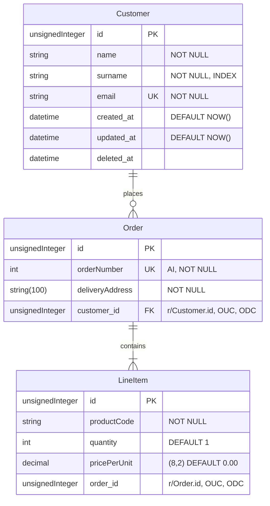

[Back to index](../README.md)

# Laravel Blueprint

<!-- TOC -->
* [Laravel Blueprint](#laravel-blueprint)
  * [Intro](#intro)
  * [Requirements](#requirements)
  * [Installation](#installation)
  * [Generating components](#generating-components)
    * [Defining models](#defining-models)
    * [Defining controllers](#defining-controllers)
<!-- TOC -->

## Intro

Blueprint is an open source project by [Shift](https://laravelshift.com/).\
At its core, it allows developers to rapidly develop multiple Laravel components
from a single, human-readable domain language.

Blueprint uses a simple YAML syntax to define models and controllers, offering shorthands and leveraging conventions to maximize the developer experience.

It comes with artisan commands making it easy and familiar to build new components and reference existing within your Laravel application.

It can be used to generates models, controllers, factories, migrations, form requests, events, jobs, mailables and tests.

The two main purposes of Blueprint are:

1. Increase development speed
2. Promote Laravel conventions

## Requirements

- A Laravel application running version 6.0 or higher.
- It currently assumes a standard project structure using the default App namespace.

## Installation

Install both Blueprint and the Laravel Test Assertion packages as development dependencies of your Laravel application:
```
composer require --dev laravel-shift/blueprint
composer require --dev jasonmccreary/laravel-test-assertions
```

Ignore files Blueprint uses from version control.\
These files are mainly used as a "scratch pad" or "local cache".\
So it's unlikely you'd want to track their changes.

You can quickly add these files to your `.gitignore` with the following command:
```
echo '/draft.yaml' >> .gitignore
echo '/.blueprint' >> .gitignore
```

## Generating components
Blueprint provides `artisan` commands to generate multiple Laravel components from a draft file.\
The draft file contains a definition using a YAML syntax, with a few shorthands for convenience.

By default, the `blueprint:build` command attempts to load a `draft.yaml` (or `draft.yml`) file.\
While you are welcome to create multiple draft files, it's common to simply reuse the draft.yaml file over and over to generate code for your application.

Within the draft file you define models and controllers using an expressive, human-readable YAML syntax.

Let's define a draft file for the following system:



Let's create our `draft.yaml` file by running `php artisan blueprint:new`.\
Make sure that the Lando container is running and that you modify the .env file to enable the connection the DB through the localhost.

With this you get 2 files: `.blueprint` and `draft.yaml`, each of them almost empty.

`.blueprint` holds the cache of the Blueprint plugin, with the reference of all the entities traced.\
At this point, the only entity traced is User (shipped with Laravel).

```yaml
models:
    User: { name: string, email: string, email_verified_at: 'datetime nullable', password: string, remember_token: 'string:100 nullable' }
```

`draft.yaml` will define 2 empty sections: models and controllers.\
Let's play with it!

### Defining models
The docs for model definitions can be found here https://blueprint.laravelshift.com/docs/defining-models/. \
Let's change our model section to be like this:
```yaml
models:
  Customer:
    name: string
    surname: string
    email: email
  Order:
    orderNumber: integer autoIncrement
    deliveryAddress: string:100
  LineItem:
    productCode: string
    quantity: integer default:1
    pricePerUnit: decimal:8,2 default:0.00
```

That covers a good part of the requirements.\
We defined the name of the fields, their type, their default value, their max length and the autoIncrement feature.\
These will all be used for the request validation.

But something is still missing.\
What about our id, created_at, updated_at and deleted_at fields?\
And what about the index and unique constraints or the foreign keys?

Blueprint will automatically add `id`, `created_at` and `updated_at` to any model.\
It also provide a nice shorthand for the `deleted_at` field. We can add it to the model using `softDeletes`.\
For additional constraints, we can use `unique` and `index`.

Let's add this info!

```yaml
models:
  Customer:
    name: string
    surname: string index
    email: email unique
    softDeletes
  Order:
    orderNumber: integer autoIncrement
    deliveryAddress: string:100
  LineItem:
    productCode: string
    quantity: integer default:1
    pricePerUnit: decimal:8,2 default:0.00
```

Ok! Now, what about the foreign keys?\
We have 2 ways to do that.

1. We specify the fields, using the naming convention from Laravel
2. We define the relationships between the models and let Blueprint handle the creation of the fields.

Let's take the second approach.\
To keep the file well organized, it's better to add the relationships at the end of the model, after all the fields.

```yaml
models:
  Customer:
    name: string
    surname: string index
    email: email unique
    softDeletes
    relationships:
      hasMany: Order
  Order:
    orderNumber: integer autoIncrement
    deliveryAddress: string:100
    relationships:
      hasMany: LineItem
      belongsTo: Customer
  LineItem:
    productCode: string
    quantity: integer default:1
    pricePerUnit: decimal:8,2 default:0.00
    relationships:
      belongsTo: Order
```

Blueprint will automatically generate the following foreign keys:

- `customer_id` in the orders table
- `order_id` in the line_items table

So far, so good. Let's move to the controllers.

### Defining controllers

